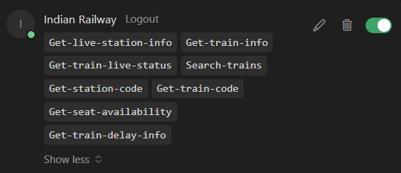
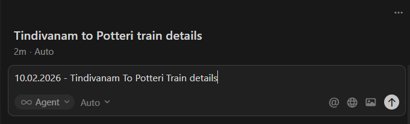
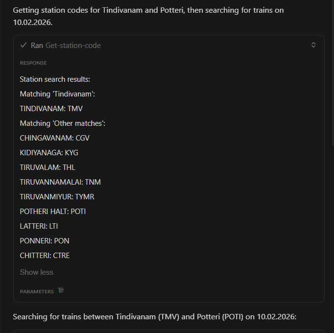
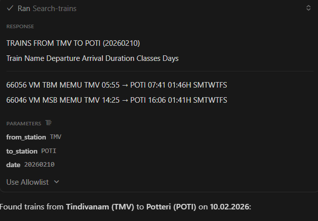
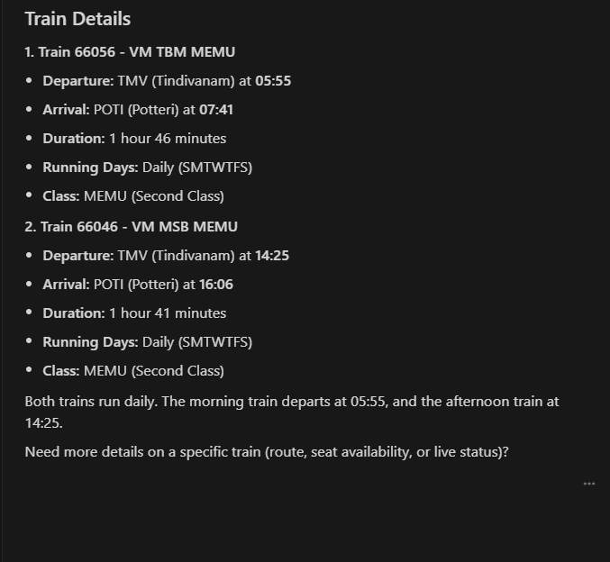

# -AI-Railway-Assistant-using-MCP-Server
An AI-powered Railway Assistant built using Cursor IDE and MCP Server integration. This project enables an AI Agent to fetch real-time Indian Railway data using MCP tools and respond to user queries in natural language.


## 📌 Project Overview

This project demonstrates how an **AI Agent** can dynamically interact with **real-world APIs** using **MCP Server architecture**.
When a user asks train-related questions, the agent automatically selects the appropriate MCP tool and fetches **live railway information**.

---

## ✨ Features

* 🔍 Search trains between two stations
* 🏫 Fetch station codes automatically
* ⏱️ Get live train running status
* ⚠️ Check train delay information
* 💺 Seat availability lookup
* 🚆 Train number and train info lookup
* 🤖 Automatic MCP tool selection by AI Agent
* 📅 Works for any date dynamically

---

## 🧠 System Architecture

```
User Query (Natural Language)
        ↓
AI Agent (Cursor IDE)
        ↓
MCP Server (mcp.json)
        ↓
Indian Railway MCP APIs
        ↓
Real-time Train Details
```

---

## 🛠️ Tech Stack

* **Cursor IDE**
* **MCP Server**
* **Indian Railway MCP API**
* **JSON-based Configuration**
* **AI Agent (Tool-based automation)**

---

## 🔧 MCP Configuration

Create a file named **`mcp.json`** in the project root and add the following:

```json
{
  "mcpServers": {
    "Indian Railway": {
      "url": "https://railway-mcp.amithv.xyz/mcp"
    }
  }
}
```

Once configured, the AI Agent automatically gets access to multiple railway tools.

---

## 🧰 MCP Tools Enabled

* Get station code
* Search trains between stations
* Get live station info
* Get train live status
* Get train delay info
* Get train information
* Get seat availability

---

## 🚀 Example Usage

### User Query

```
10.02.2026 - Tindivanam to Potteri train details
```

### AI Agent Actions

* Fetches station codes (TMV → POTI)
* Searches available trains for the given date
* Formats and displays results clearly

### Sample Output

* Train number and name
* Departure and arrival times
* Travel duration
* Running days
* Class information

---

## 📸 Screenshots

This repository includes screenshots showing:

* MCP tools enabled in Cursor IDE
 

---
* User Input
  
---

* AI Agent fetching station codes
  
---

* Train search results using MCP tools
 
---

* Final formatted train details output
  

*(Refer to the `screenshots/` folder)*

---

## 🎯 Use Cases

* AI-based railway enquiry system
* MCP Server + AI Agent integration demo
* Automation using real-world APIs
* Portfolio and interview project
* Learning MCP-based agent workflows

---

## 🔮 Future Enhancements

* Web UI using React
* WhatsApp / Telegram bot integration
* Multi-language support
* Voice-based queries
* API response caching
* User-friendly dashboard

---

## 🧑‍💻 Author

**Aravindhan K**
📍Tindivanam, Villupuram, India

---

## ⭐ Support

If you find this project useful, please give it a ⭐ on GitHub.

---

## ✅ Notes

* No API keys are exposed
* No hardcoded train data
* Fully dynamic and scalable MCP configuration

---
